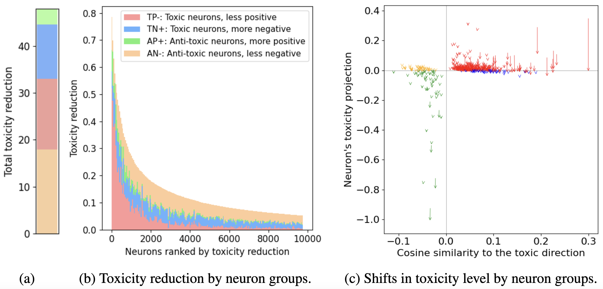

# Unpacking DPO: How Neuron Dynamics Drive Toxicity Reduction

This repository provides the code for [Ablation is Not Enough to Emulate DPO:
How Neuron Dynamics Drive Toxicity Reduction](XXXXX), accepted at NeurIPS 2024 workshop [Foundation Model Interventions (MINT)]([https://sites.google.com/view/neurips2024-ftw](https://sites.google.com/view/mint-2024/)).



Building on findings from [[1]](https://arxiv.org/abs/2401.01967), we found that DPO’s effect is not solely due to dampened toxic neurons. Instead, DPO accumulates effects across multiple neuron groups to reduce toxicity (see graph above), both reducing toxicity and promoting anti-toxicity in the residual stream.

## Models and data

We replicated the models and datasets used in paper [A Mechanistic Understanding of Alignment Algorithms: A Case Study on DPO and Toxicity](https://arxiv.org/abs/2401.01967).

The models and datasets are available [here](https://drive.google.com/drive/folders/1baArqcjIc2Q4OllLVUz1hp3p3XxmdteK?usp=drive_link).

Save the checkpoints under `./checkpoints` and unzip the data files under `./data`.

## Experiments

All of our experiments can be found under `./toxicity`.

To apply ablation or activation patching, see `./toxicity/eval_interventions/run_evaluations.py`.

To re-create figures for toxicity projection, see `./toxicity/hooked.ipynb`.

To re-create figures for neuron groups, see `./toxicity/contribution_2D_plot.ipynb`.

## How to Cite

If you find our work relevant, please cite it as follows:
```bibtex
@misc{yang2024finetuninglargelanguagemodels,
      title={Fine-tuning Large Language Models with Human-inspired Learning Strategies in Medical Question Answering}, 
      author={Yushi Yang and Andrew M. Bean and Robert McCraith and Adam Mahdi},
      year={2024},
      eprint={2408.07888},
      archivePrefix={arXiv},
      primaryClass={cs.CL},
      url={https://arxiv.org/abs/2408.07888}, 
}
```
